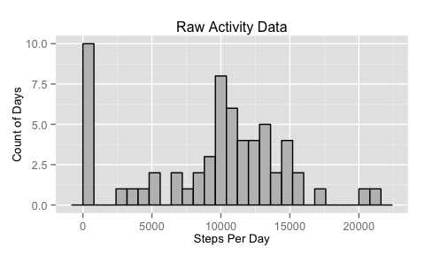
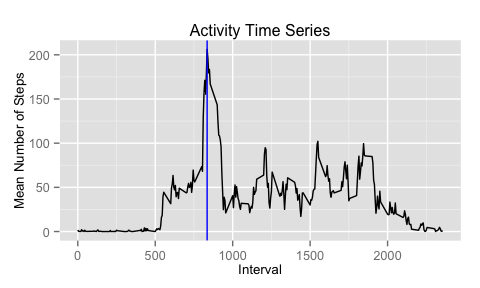
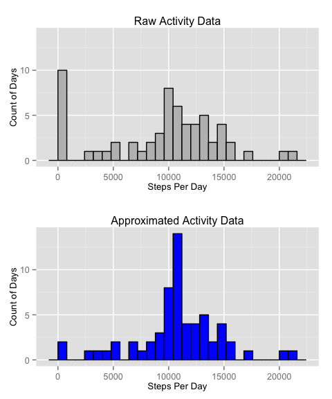
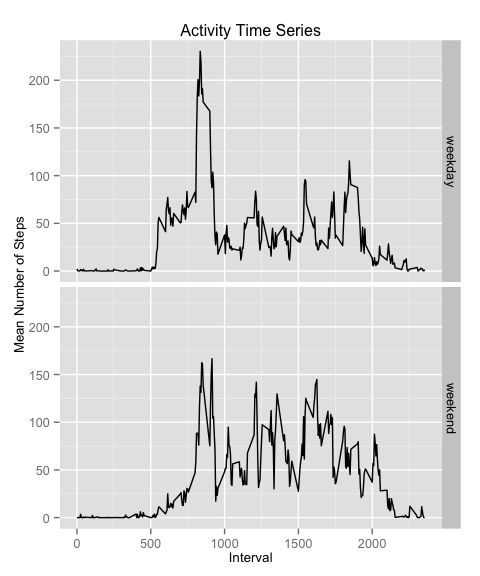

# Reproducible Research: Peer Assessment 1
Kevin Fowler  

This report provides an analysis of the activity data from a personal 
activity monitoring device. This device collected data at 5 minute
intervals through out the day. The data consists of two months of data
from an anonymous individual collected during the months of October and
November, 2012 and include the number of steps taken in 5 minute
intervals each day.

The data was downloaded from the course website on January 6, 2016. The
variables included in this dataset are:

* steps: Number of steps taking in a 5-minute interval (missing values are coded as 𝙽𝙰)
* date: The date on which the measurement was taken in YYYY-MM-DD format
* interval: Identifier for the 5-minute interval in which measurement was taken

The dataset is stored in a comma-separated-value (CSV) file and there are a total of 17,568 observations in this dataset.


## Loading and preprocessing the data
The dataset was loaded into R using the code statement below. The only
preprocessing performed was to assign the variable types of integer,
Date and integer to the three variables described above. The variable 
names were considered satisfactory.

```r
activity <- read.csv("./activity.csv",
                     colClasses = c("integer", "Date", "integer"),
                     stringsAsFactors = FALSE)
```


## What is mean total number of steps taken per day?
For an inital exploratory investigation, the total steps taken each
day are derived from the raw data, and used to produce a histogram of 
the number of steps per day, as well as the mean and median values.

This is the code used to summarize the data and calculate the values.
Note that NA measurements are ignored in summarization, so days with 
all measurements missing will have 0 steps.

```r
activity_day <- 
    activity %>%
    group_by(date) %>%
    summarise(stepsTaken = sum(steps, na.rm = TRUE))

mean_steps <- mean(activity_day$stepsTaken)
median_steps <- median(activity_day$stepsTaken)
```

The following is the histogram of the total steps each day in bins of 
800 steps:

```r
sect2hist <- 
    ggplot(data = activity_day, aes(stepsTaken)) + 
    geom_histogram(binwidth = 800,
                   col="black", fill="gray") + 
    labs(title = "Raw Activity Data", 
         x = "Steps Per Day", 
         y = "Count of Days") +
    theme(plot.title = element_text(size=12)) +
    theme(axis.title = element_text(size=10))
sect2hist
```

 

Note the large number of days in the bin containing zero steps - this is
an artifact of several days containing missing (NA) values.

Lastly, the summary values of that distribution:

```
The mean number of steps taken per day is 9354.23
```

```
The median number of steps taken per day is 10395
```


## What is the average daily activity pattern?
The next step in this analysis looks at the activity pattern over the 
course of an average day. The raw data is summarized over all days for
each interval, calculating the average number of steps for each interval
over the 61-day measurement period.

This is the code used to perform that summarization. Note that the mean
statement averages only over days that have a non-NA steps value. This 
approximation will be corrected for in a later section.

```r
activity_interval <- 
    activity %>%
    group_by(interval) %>%
    summarise(meanStepsPerInterval = mean(steps, na.rm = TRUE))

maxMeanStepsInterval <- filter(activity_interval, 
                              meanStepsPerInterval == 
                                  max(meanStepsPerInterval))$interval
```

The following plot shows the mean steps across the daily interval time 
series.

```r
ggplot(data = activity_interval, 
       aes(interval, meanStepsPerInterval)) + 
    geom_line() + 
    labs(title = "Activity Time Series", 
         x = "Interval", 
         y = "Mean Number of Steps") + 
    geom_vline(xintercept = maxMeanStepsInterval, 
               col = "Blue") +
    theme(plot.title = element_text(size=12)) +
    theme(axis.title = element_text(size=10))
```

 


```
The maximum mean steps (Blue line in plot) in a single interval 
occurred during interval 835
```


## Imputing missing values
As noted above, any NA "step" values were ignored in the summarization 
calculations. The following code was used to determine the number of
such missing values:

```r
numMissingStepsValues <- nrow(filter(activity, is.na(steps)))
totalStepsValues <- nrow(activity)
```

```
There are 2304 missing "steps" values in the raw data
```

```
There are 17568 total "steps" values in the raw data
```
Since approximately 13% of the values are missing, if we can make a 
sensible estimate of what their value would have been if measured, then
the resulting summarizations may be more accurate.

As a first approximation to imputing those missing values,
the mean value for a given interval is written to all such intervals 
that have missing values. For example, if the fifth interval on day six
is missing, then we set it equal to the mean value for the fifth 
interval over all non-missing days.

The code that performs this approximation is below. The mean values from
the activity_interval table calculated in the previous section are used
to set the missing values in the raw activity table:

```r
activity_approx <-
    activity %>%
    mutate(steps = ifelse(is.na(steps), 
                          activity_interval$meanStepsPerInterval, 
                          activity$steps))
```
Now the approximated activty data is used to re-calculate the histogram
data and mean/median number of steps that was calculated during the 
initial exploration.

```r
activity_day_approx <- 
    activity_approx %>%
    group_by(date) %>%
    summarise(stepsTaken = sum(steps, na.rm = TRUE))

mean_steps_approx <- mean(activity_day_approx$stepsTaken)
median_steps_approx <- median(activity_day_approx$stepsTaken)
```

This yields the following plot and values. For easy comparison, the 
original histogram based on the raw data is reproduced above the new
one based on the approximated data (using same range on both sets of
axes).

```r
sect2hist <-
    sect2hist +
    ylim(0,14)
sect4hist <- 
    ggplot(data = activity_day_approx, aes(stepsTaken)) + 
    geom_histogram(binwidth = 800,
                   col="black", fill="blue") + 
    ylim(0,14) +
    labs(title = "Approximated Activity Data", 
         x = "Steps Per Day", 
         y = "Count of Days") +
    theme(plot.title = element_text(size=12)) +
    theme(axis.title = element_text(size=10))

grid.arrange(sect2hist, sect4hist)
```

 

This effect of the approximation on this histogram was to move 8 days 
from the first (zero) bin to the bin containing the mean number of steps. 
Thos 8 days were ones for which no data was collected. In all other days
there were no missing data.

Lastly, the summary values of that distribution:

```
The mean number of steps taken per day is 10766.19
```

```
The median number of steps taken per day is 10766.19
```
The median is now equal to the mean, and both are greater than was the 
case when the missing data produced 8 days with zero total steps. This
increase in value is, of course, expected.

Interestingly, the mean and median values are now _exactly_ the same to
several decimal places. This means that the approximated distribution is
perfectly symmetric around the mean. I am not sure how to interpret that
result except to suspect that the data were really generated
artificially since no single human would be likely to produce such a
symmetric result.


## Are there differences in activity patterns between weekdays and weekends?
As a final step in this analysis, the activity on weekdays or weekends 
is compared. For this purpose the approximated data (activity_approx)
is modified to have a dayType factor indicating whether it is a 
"weekend" or a "weekday":

```r
activity_approx <-
    activity_approx %>%
    mutate(dayType = ifelse((wday(date) == 1 | wday(date) == 7), 
                                "weekend", "weekday")) %>%
    mutate(dayType = as.factor(dayType))

activity_interval_approx <- 
    activity_approx %>%
    group_by(interval, dayType) %>%
    summarise(meanStepsPerInterval = mean(steps, na.rm = TRUE))
```
Then we reproduce the total steps histogram but with one panel each
for the weekend and weekday data

```r
ggplot(data = activity_interval_approx, 
       aes(interval, meanStepsPerInterval)) + 
    geom_line() + 
    facet_grid(dayType ~ .) +
    labs(title = "Activity Time Series", 
         x = "Interval", 
         y = "Mean Number of Steps") + 
    theme(plot.title = element_text(size=12)) +
    theme(axis.title = element_text(size=10))
```

 

Several differences can be seen:

* There is more activity earlier in the day on weekdays than on weekends
* On weekdays there is considerable activity between 8am and 9am, perhaps
from walking to work, and a lesser peak between 4pm and 5pm, perhaps 
because the leaving time is not consistent.
* The activity on weekends is spread more evenly between 8am and 8pm,
indicating less time sitting/standing at work and more time moving 
around doing various weekend activities.
